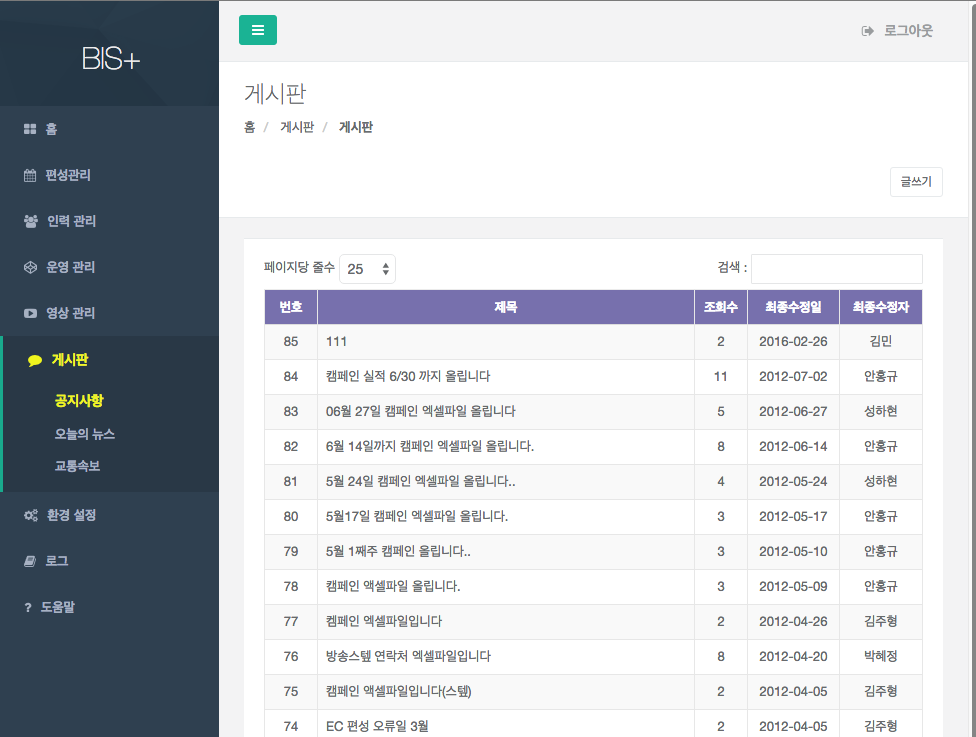
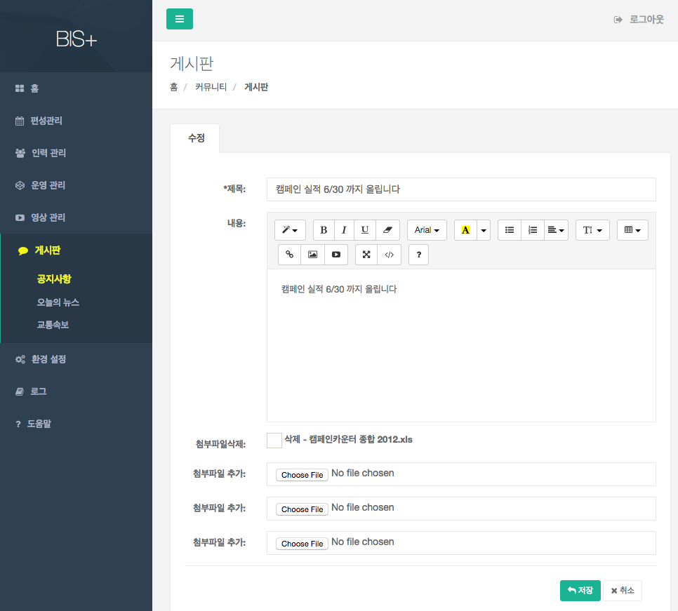

# 공지사항

- 개요 : 공지사항 목록을 관리하는 게시판이다.
- 조회 : 메뉴에 들어가면 최종수정일순의 목록을 출력한다. 목록에서 항목을 클릭하면 해당 항목의 상세 내용을 조회할 수 있다.

- 신규 : 목록에서 [글쓰기] 버튼을 클릭하여 신규 항목을 생성 할 수 있다.
- 수정 : 게시물을 클릭하여 상세 화면에서  [수정] 버튼을 눌러 항목을 수정 할 수 있다.

- 삭제 :게시물을 클릭하여 상세 화면에서 [삭제] 버튼을 눌러 삭제 할 수 있다. 

		