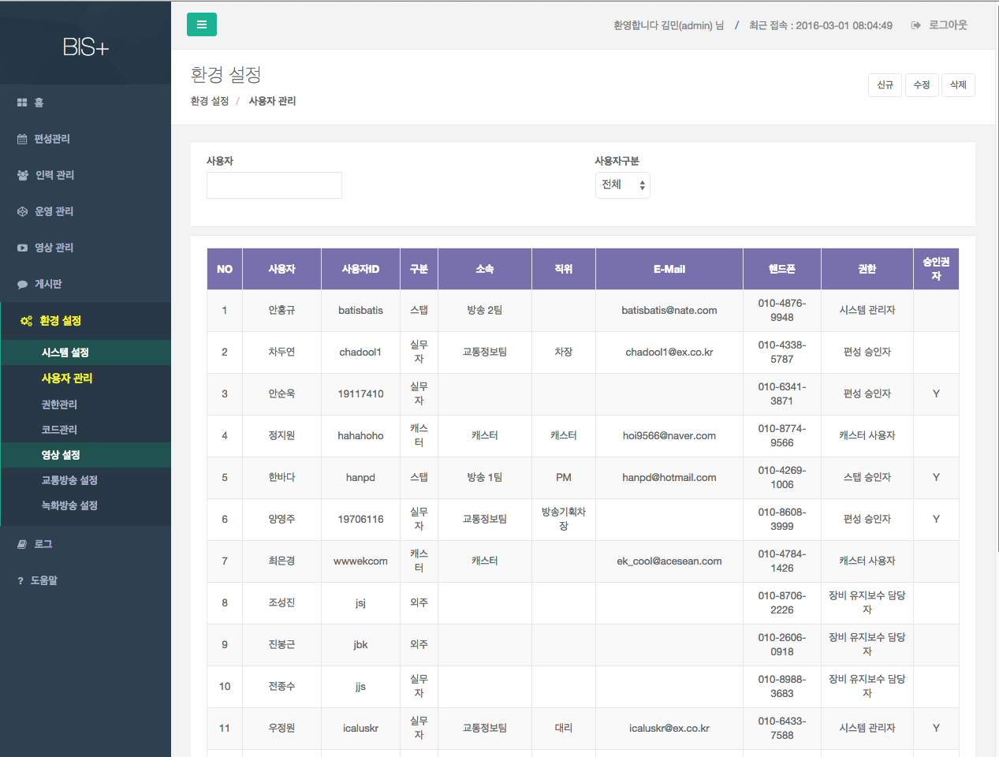
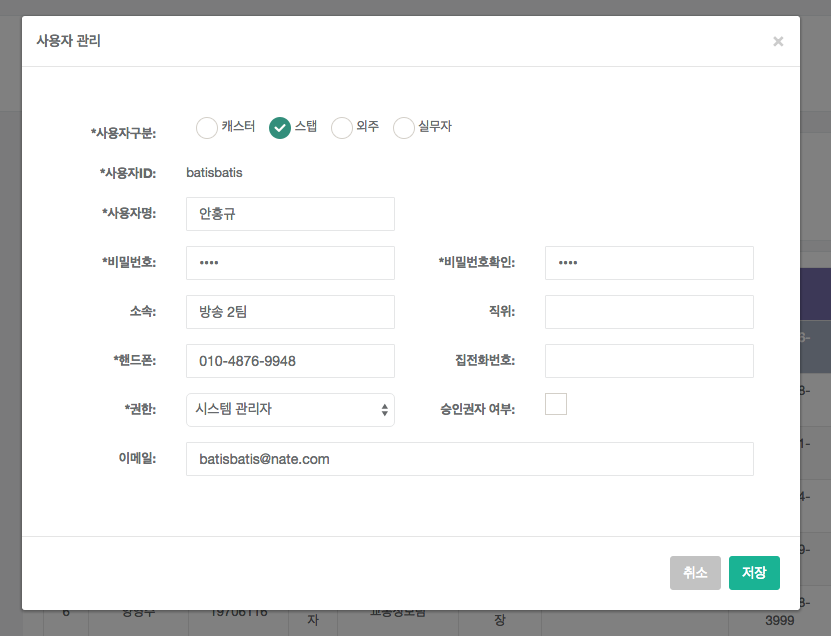

# 사용자 관리

시스템내의 사용자를 관리하는 화면이다.

> 주의사항 : 캐스터와 스탭을 등록하기 위해서는 반드시, 인력관리 중 캐스터현황 또는 스탭 현황에서 담당자를 등록 한 후, 사용자 관리에서 계정을 추가해야 한다.

- 조회 : 사용자명, 구분을 입력 한 후 엔터를 눌러 조회를 수행한다.

- 신규 : [신규]버튼을 눌러 신규 사용자를 추가한다.
	- 사용자구분:  캐스터, 스탭, 외주, 실무자 중 선택한다. 캐스터나 스탭을 경우에는 사용자 명 옆에 선택 상자가 나타나는데 여기서 해당 캐스터 또는 스탭을 선택한다.
	- 사용자ID : 사용자ID를 입력한다.
	- 사용자명 : 사용자명을 입력한다.
	- 비밀번호/비밀번호확인 : 비밀번호를 입력한다.
	- 소속 : 소속을 입력한다.
	- 직위 : 직위를 입력한다.
	- 핸드폰 : 핸드폰을 입력한다.
	- 집전화번호 : 집전화번호를 입력한다.
	- 권한 : 권한을 선택한다.
	- 승인권자 여부: 승인권자 여부를 선택한다. 승인권자가 선택되어 있을 경우 편성 및 근무표 관리에서 승인권자 목록에 출력된다.
	- 이메일: 이메일을 입력한다.
	- 저장버튼을 눌러 항목을 저장한다.

- 수정 : 목록에서 수정할 항목을 클릭하여 선택한 후, [수정]버튼을 눌러 신규 사용자를 추가한다.
	- 사용자구분:  캐스터, 스탭, 외주, 실무자 중 선택한다. 캐스터나 스탭을 경우에는 사용자 명 옆에 선택 상자가 나타나는데 여기서 해당 캐스터 또는 스탭을 선택한다.
	- 사용자명 : 사용자명을 입력한다.
	- 비밀번호/비밀번호확인 : 비밀번호를 입력한다.
	- 소속 : 소속을 입력한다.
	- 직위 : 직위를 입력한다.
	- 핸드폰 : 핸드폰을 입력한다.
	- 집전화번호 : 집전화번호를 입력한다.
	- 권한 : 권한을 선택한다.
	- 승인권자 여부: 승인권자 여부를 선택한다. 승인권자가 선택되어 있을 경우 편성 및 근무표 관리에서 승인권자 목록에 출력된다.
	- 이메일: 이메일을 입력한다.
	- 저장버튼을 눌러 항목을 저장한다.

- 삭제 : 목록에서 삭제할 항목을 클릭하여 선택한 후, [삭제]버튼을 눌러 삭제한다.
