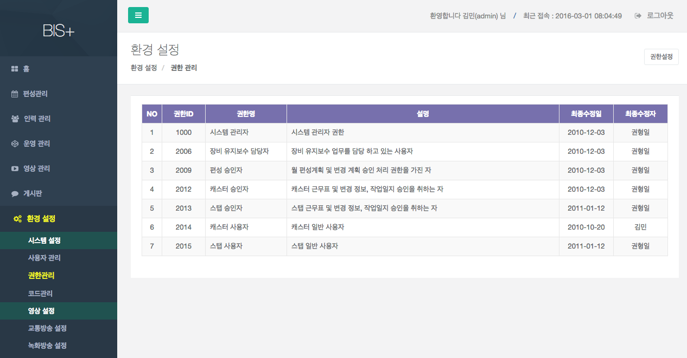
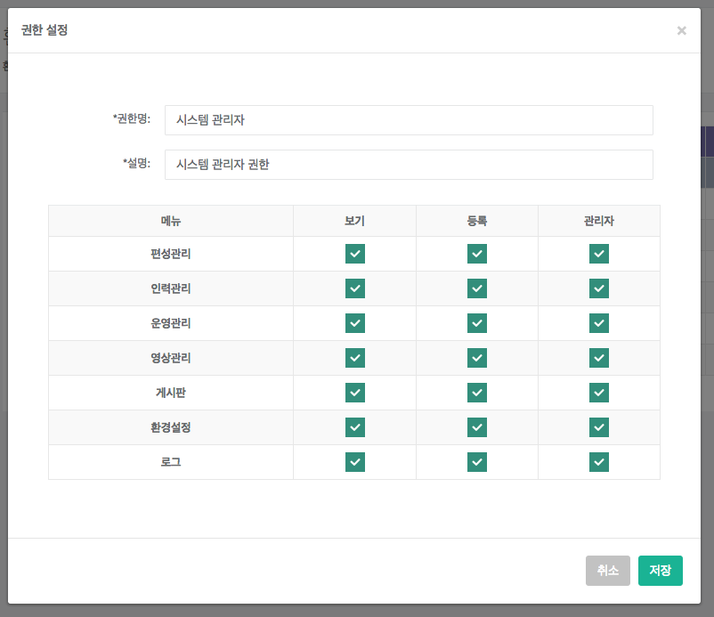

# 권한 관리

- 개요 : 시스템내 사용되는 사용자별 권한을 관리하는 화면이다.

- 수정 : 해당 항목을 클릭 한 후 [권한 설정] 버튼을 눌러 수정한다.
	- 권한명, 설명을 입력한다.
	- 각 메뉴별 보기,등록,관리자 여부를 선택한다.
		- 보기 : 열람 할 수 있는 권한이다.
		- 등록 : 작성 할 수 있는 권한이다.
		- 관리 : 승인을 할 수 있는 권한이다.

