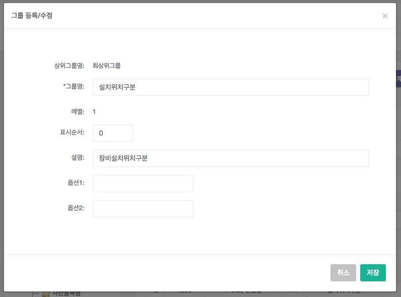

# 코드 관리

- 개요 : 시스템 내에서 사용하는 코드 (방송매체, 설치구분, 팀구분, 근무 구분 등)를 관리하는 화면이다.

- 그룹 관리 

	

	- 신규 : 생성할 그룹 항목의 상위 분류를 선택 한 후, [그룹신규] 버튼을 눌러 생성한다.
		- 그룹명 : 그룹명을 입력한다.
		- 표시순서 : 표시순서(0~99까지의 정수)를 입력한다. 
		- 설명 : 설명을 입력한다.
		- 옵션1,2 : 시스템 내부적으로 사용하는 항목이므로, 생략한다.
		- [저장] 버튼을 클릭하여 저장한다.
	- 수정 : 수정할 그룹 항목을 선택 한 후 [그룹수정] 버튼을 눌러 수정한다.
		- 그룹명 : 그룹명을 입력한다.
		- 표시순서 : 표시순서(0~99까지의 정수)를 입력한다. 
		- 설명 : 설명을 입력한다.
		- 옵션1,2 : 시스템 내부적으로 사용하는 항목이므로, 생략한다.
		- [저장] 버튼을 클릭하여 저장한다.
	- 삭제 : 삭제할 그룹 항목을 선택 한 후 [그룹삭제] 버튼을 눌러 수정한다. 
- 코드 관리

	

	- 신규 : 생성할 코드 항목의 상위 분류를 선택 한 후, [신규] 버튼을 눌러 생성한다.
		- 코드명(제목) : 코드명을 입력한다.
		- 표시순서 : 표시순서(0~99까지의 정수)를 입력한다. 
		- 설명 : 설명을 입력한다.
		- 옵션1,2,연계코드 : 시스템 내부적으로 사용하는 항목이므로, 생략한다.
		- [저장] 버튼을 클릭하여 저장한다.
	- 수정 : 수정할 코드 항목을 선택 한 후 [수정] 버튼을 눌러 수정한다.
		- 코드명(제목) : 코드명을 입력한다.
		- 표시순서 : 표시순서(0~99까지의 정수)를 입력한다. 
		- 설명 : 설명을 입력한다.
		- 옵션1,2,연계코드 : 시스템 내부적으로 사용하는 항목이므로, 생략한다.
		- [저장] 버튼을 클릭하여 저장한다.
	- 삭제 : 삭제할 코드 항목을 선택 한 후 [삭제] 버튼을 눌러 삭제한다. 
