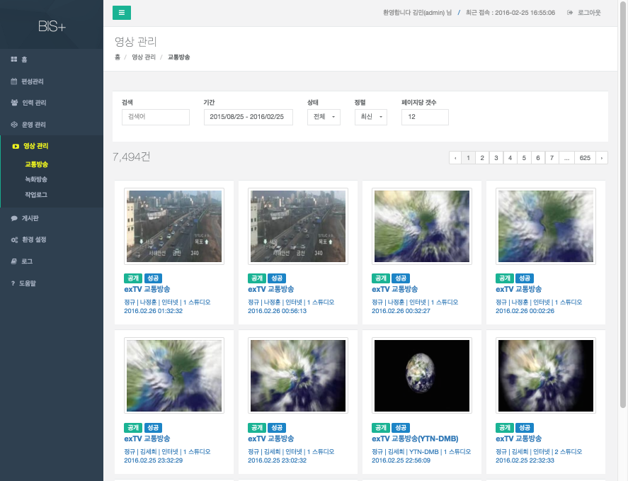
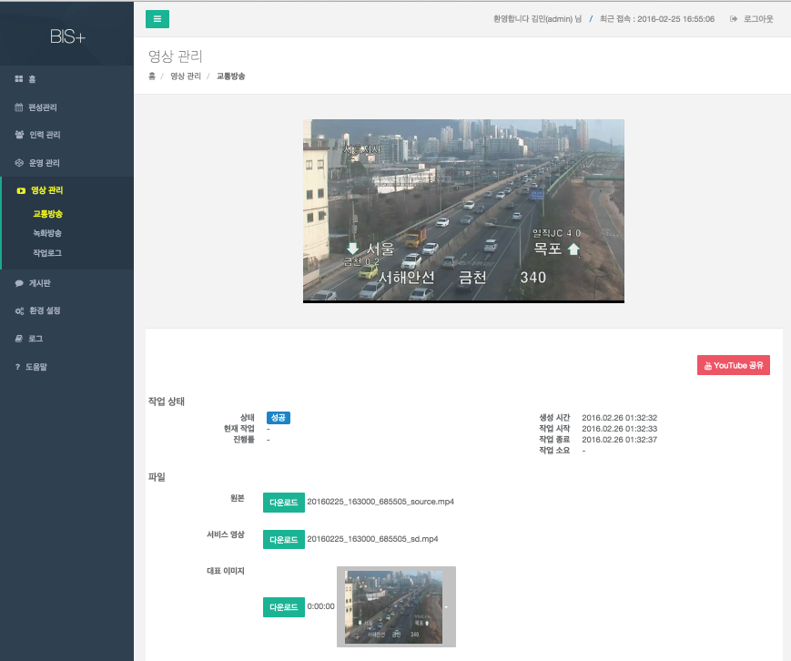
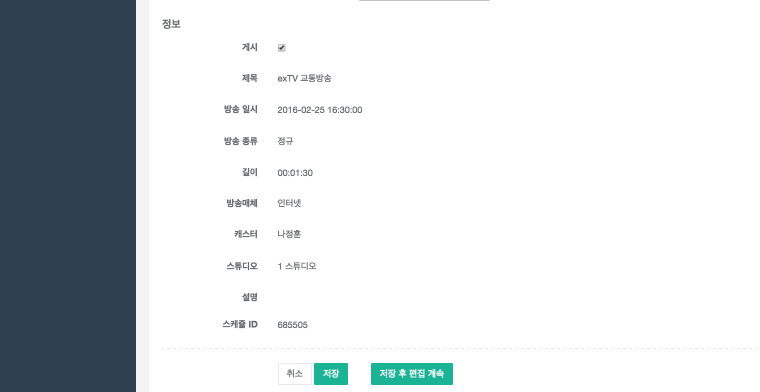
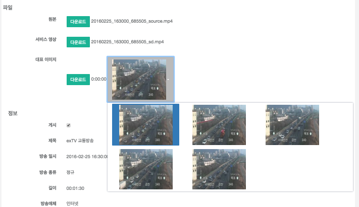
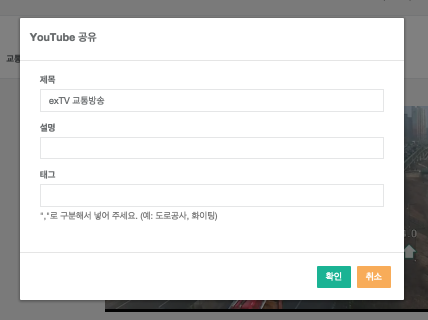

# 교통방송

## 개요

정규 교통방송 내역 조회 및 게시여부 관리 기능을 제공한다.

## 조회 

검색어, 기간, 상태, 정렬, 페이지당 갯수를 입력하면 조회가된다. 

- 각 항목의 간략한 정보가 썸네일 이미지와 함께 출력된다.
- 공개여부와 배포 성공 여부가 [공개 또는 비공개], [성공 또는 실패]로 표시된다.
- 조회된 목록에서 썸네일 이미지를 클릭하면 각 항목의 미리보기 영상을 확인 할 수 있다. 
- 내용을 클릭하면 해당 항목의 상세 내용을 확인 할 수 있다.

## 상세 내용 조회 및 수정

- 상단에 해당 항목의 영상이 재생된다.
- 작업상태에 해당 작업의 작업 상태가 출력된다.
- 파일에 해당 항목의 원본/서비스영상/대표이미지가 표시된다. [다운로드] 버튼을 클릭하여 다운로드 할 수 있다.
- 게시 : 체크 버튼을 이용해 게시 여부를 수정할 수 있다.
- 대표이미지 선택 : 대표이미지를 클릭하여 대표이미지를 선택 할 수 있다.

- 변경사항이 있을 경우 [저장]버튼을 클릭하면 저장 후 목록으로 이동하고, [저장 후 편집 계속]을 클릭하면 현재 항목 화면에 계속 남는다.

## 상세 내용 조회 - YouTube 공유

- 상세 내용 조회 화면에서 [YouTube 공유] 버튼을 클릭하면, YouTube 공유 화면에 나타나며, 상세 정보를 입력한 후 확인 버튼을 누르면 YouTube에 공유할 수 있다. 
