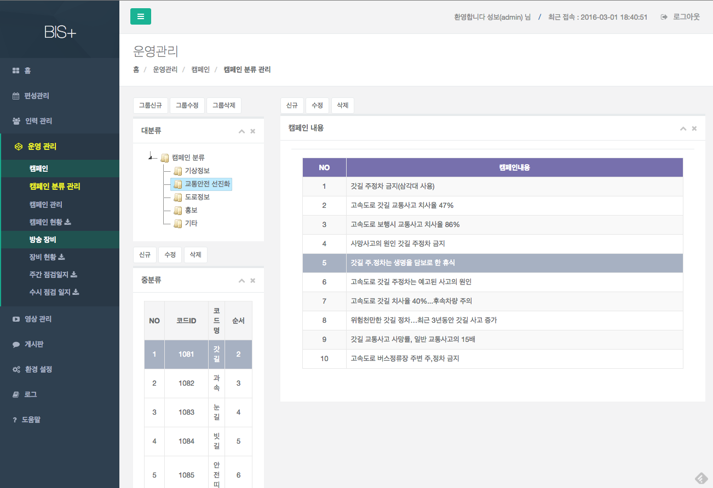
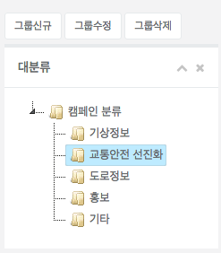
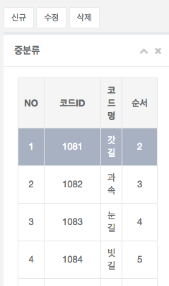
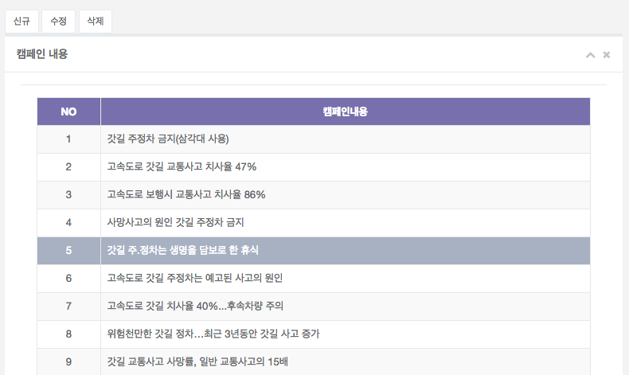
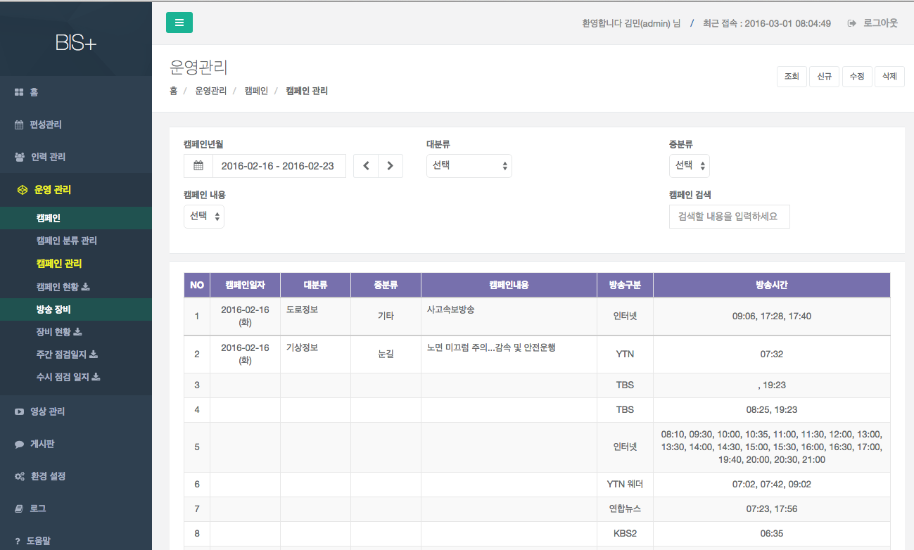
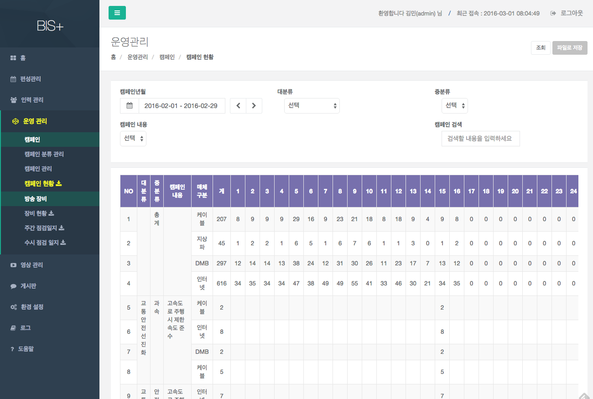

# 캠페인 관리

캠페인 분류를 관리하고, 캠페인 내역을 기록하며, 현황을 조회하는 기능을 제공한다.

## 캠페인 분류 관리

- 개요 : 캠페인 분류를 관리하는 화면이다.
- 대분류 관리 

	
	
	- 신규 : 생성할 캠페인 분류 항목의 상위 분류를 선택 한 후, [그룹신규] 버튼을 눌러 생성한다.
		- 캠페인분류명 : 분류명을 입력한다.
		- 표시순서 : 표시순서(0~99까지의 정수)를 입력한다. 
	- 수정 : 수정할 캠페인 분류 항목을 선택 한 후 [그룹수정] 버튼을 눌러 수정한다.
		- 캠페인분류명 : 분류명을 입력한다.
		- 표시순서 : 표시순서(0~99까지의 정수)를 입력한다. 
	- 삭제 : 삭제할 캠페인 분류 항목을 선택 한 후 [그룹삭제] 버튼을 눌러 수정한다. 
	- 
- 중분류 관리

	
	
	- 신규 : 생성할 캠페인 분류 항목의 상위 분류를 선택 한 후, [신규] 버튼을 눌러 생성한다.
		- 코드명(제목) : 분류명을 입력한다.
		- 표시순서 : 표시순서(0~99까지의 정수)를 입력한다. 
		- 설명 : 설명을 입력한다.
	- 수정 : 수정할 캠페인 분류 항목을 선택 한 후 [수정] 버튼을 눌러 수정한다.
		- 코드명(제목) : 분류명을 입력한다.
		- 표시순서 : 표시순서(0~99까지의 정수)를 입력한다. 
		- 설명 : 설명을 입력한다.
	- 삭제 : 삭제할 캠페인 분류 항목을 선택 한 후 [삭제] 버튼을 눌러 삭제한다. 
- 소분류 관리

	
	
	- 신규 : 생성할 캠페인 항목의 상위 분류를 선택 한 후, [신규] 버튼을 눌러 생성한다.
		- 내용 : 캠페인 내용을 입력한다.
	- 수정 : 수정할 캠페인 항목을 선택 한 후 [수정] 버튼을 눌러 수정한다.
		- 내용 : 캠페인 내용을 입력한다.
	- 삭제 : 삭제할 캠페인 항목을 선택 한 후 [삭제] 버튼을 눌러 삭제한다. 

##캠페인 관리

- 개요 : 캠페인 진행 내역을 관리하는 화면이다.
- 조회 : 캠페인년월, 대,중분류, 캠페인 내용을 선택하거나, 캠페인 검색에 검색어를 입력 한 후 [조회] 버튼을 눌러 조회한다.
- 신규 : [신규] 버튼을 눌러 캠페인 내용을 생성한다.
	- 캠페인 일자를 선택한다.
	- 아래 두가지 방법중 한가지를 택일하여 캠페인 내용을 선택한다.
		- 캠페인 검색에 검색어를 입력하여 캠페인 내용을 선택
		- 캠페인년월, 대,중분류, 캠페인 내용을 선택
	- 방송목록에서 캠페인이 적용된 방송을 체크박스를 클릭하여 선택
	- [저장] 버튼을 눌러 저장

- 수정 : 수정 할 항목을 목록에서 클릭하여 선택한 후, [수정] 버튼을 눌러 수정한다.
	- 캠페인 일자를 선택한다.
	- 아래 두가지 방법중 한가지를 택일하여 캠페인 내용을 선택한다.
		- 캠페인 검색에 검색어를 입력하여 캠페인 내용을 선택
		- 캠페인년월, 대,중분류, 캠페인 내용을 선택
	- 방송목록에서 캠페인이 적용된 방송을 체크박스를 클릭하여 선택
	- [저장] 버튼을 눌러 저장
- 삭제 : 삭제 할 항목을 목록에서 클릭하여 선택한 후, [삭제] 버튼을 눌러 삭제한다.

## 캠페인 현황 

- 개요 : 캠페인 제공 내역을 월단위로 조회하는 화면이다.
- 조회 : 캠페인년월, 대,중분류, 캠페인 내용을 선택하거나, 캠페인 검색에 검색어를 입력 한 후 [조회] 버튼을 눌러 조회한다. (기본값은 모든 캠페인 내역 월단위 조회)
- 파일로 저장 : [파일로 저장] 버튼을 클릭하여 파일로 저장한다.

