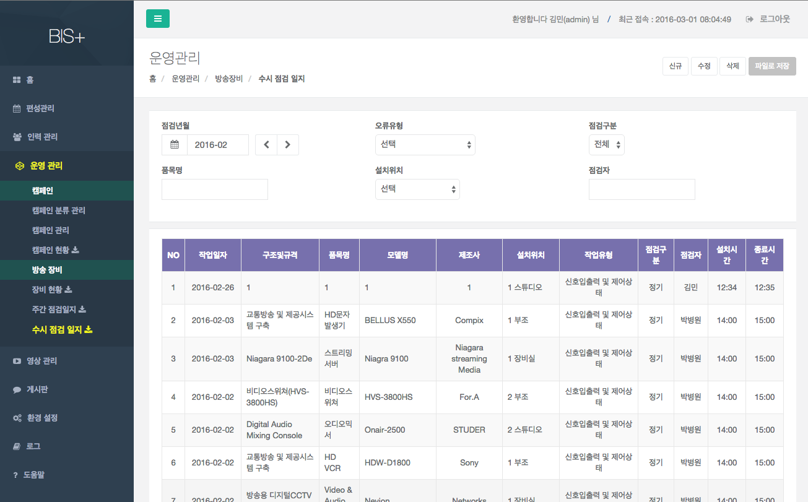

# 방송장비

방송장비 현황을 관리하고, 주간/수시 점검 일지 관리 기능을 제공한다.

## 장비현황

- 개요 : 장비현황을 관리하는 화면이다.
- 조회 : 구조및규격, 품목명, 모델명, 설치위치, 설치년도를 선택 한 후 [조회]버튼을 눌러 조회한다.
- 신규 : [신규] 버튼을 눌러 항목을 생성한다.
- 수정 : 목록에서 항목을 클릭하여 선택 한 후 [수정] 버튼을 눌러 수정한다.
- 삭제 : 목록에서 항목을 클릭하여 선택 한 후 [삭제] 버튼을 눌러 삭제한다.
- 파일로 저장 : 출력할 항목을 체크버튼을 클릭하여 선택 한 후 [파일로 저장] 버튼을 눌러 파일로 저장한다.

## 주간 점검 일지

- 개요 : 주간 점검 일지를 관리하는 화면이다.
- 조회 : 점검년월과 작성자를 입력 한 후 엔터를 눌러 조회한다.
- 신규 : [신규] 버튼을 눌러 항목을 생성한다.
- 수정 : 목록에서 항목을 클릭하여 선택 한 후 [수정] 버튼을 눌러 수정한다.
- 삭제 : 목록에서 항목을 클릭하여 선택 한 후 [삭제] 버튼을 눌러 삭제한다.
- 파일로 저장 : 출력할 항목을 클릭하여 선택 한 후 [파일로 저장] 버튼을 눌러 파일로 저장한다.

## 수시 점검 일지

- 개요 : 수시 점검 일지를 관리하는 화면이다.
- 조회 : 점검년월, 오류유형, 점검구분, 품목명, 설치위치, 점검자를 입력 한 후 엔터를 눌러 조회한다.
- 신규 : [신규] 버튼을 눌러 항목을 생성한다.
- 수정 : 목록에서 항목을 클릭하여 선택 한 후 [수정] 버튼을 눌러 수정한다.
- 삭제 : 목록에서 항목을 클릭하여 선택 한 후 [삭제] 버튼을 눌러 삭제한다.
- 파일로 저장 : 출력할 항목을 클릭하여 선택 한 후 [파일로 저장] 버튼을 눌러 파일로 저장한다.
